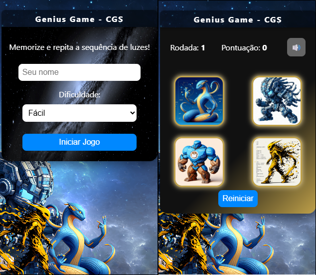
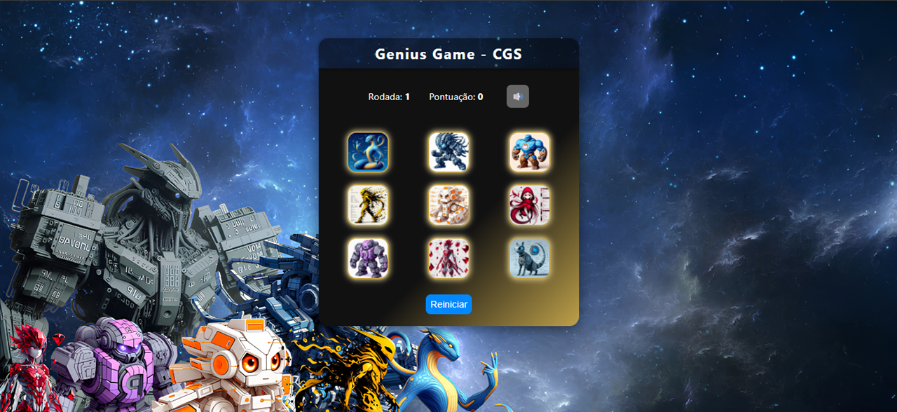

# Genius Game - CGS

Jogo da Memória sequencial desenvolvido em HTML, CSS e JavaScript, totalmente responsivo para desktop, tablets e celulares.

## Funcionalidades

- Três níveis de dificuldade: fácil, médio e difícil
- Avatares personalizados para cada card
- Sons de clique, música de fundo e efeitos de fim de jogo
- Layout adaptável para qualquer tamanho de tela
- Pontuação e rodadas exibidas em tempo real
- Botão para reiniciar o jogo e voltar ao início
- Acessibilidade visual (contraste, texto destacado)

## Exemplos de Tela

   
   

O objetivo do jogo é testar sua memória e reflexos, reproduzindo corretamente sequências de cards que vão aumentando a cada rodada.

### Passo a passo:

1. **Escolha seu nome e o nível de dificuldade**
   - Fácil: 4 cards
   - Médio: 9 cards
   - Difícil: 12 cards

2. **O jogo mostra uma sequência de cards iluminados**
   - A primeira rodada tem apenas 1 card.
   - Memorize a ordem em que os cards acendem.

3. **Reproduza a sequência clicando nos cards na mesma ordem**
   - Cada clique correto mantém você no jogo.
   - Se errar a ordem, a partida termina.

4. **A cada rodada, a sequência fica maior**
   - O jogo adiciona mais um card à sequência a cada rodada.
   - Sua pontuação aumenta conforme avança.

5. **Fim de jogo**
   - Ao errar, aparece a tela de resultado com seu nome, dificuldade, rodadas concluídas e pontuação final.
   - Você pode jogar novamente ou voltar ao início.

### Dicas

- Preste atenção nos sons e efeitos visuais para ajudar na memorização.
- Tente bater seu próprio recorde de rodadas!

## Estrutura do projeto

- `index.html`: Estrutura principal do jogo
- `style.css`: Estilos visuais e responsividade
- `main-container.css`: Layout vertical centralizado
- `script.js`: Lógica do jogo, manipulação de eventos e sons
- `assets/img/`: Imagens dos avatares e fundos
- `assets/sound/`: Arquivos de áudio

## Boas práticas aplicadas

- Código organizado e comentado
- Separação clara entre estrutura, estilo e lógica
- Responsividade garantida por media queries
- Uso de variáveis e funções para facilitar manutenção
- Classes CSS sem conflitos e com nomes descritivos
- Imagens otimizadas e adaptadas para todos os dispositivos
- Sem dependências externas, apenas HTML, CSS e JS puro

## Autor

Carlos Garcia - CGS

---

Este projeto é livre para uso e modificação. Divirta-se jogando e aprendendo!
