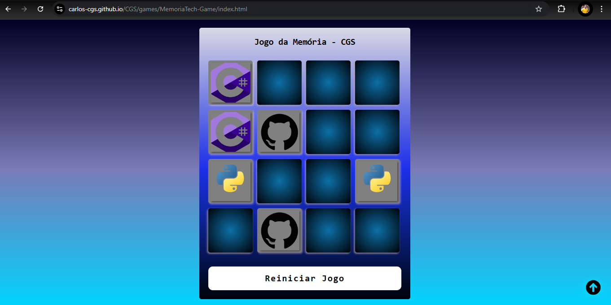

# Jogo da Memória - CGS - DIO

Um jogo da memória interativo desenvolvido com HTML, CSS e JavaScript. O objetivo é encontrar todos os pares de cartas idênticas para vencer o jogo.

## Funcionalidades

- Embaralhamento aleatório das cartas a cada início de jogo.
- Verificação de pares ao clicar nas cartas.
- Efeitos sonoros de acerto e erro para uma experiência mais imersiva.
- Mensagem de vitória exibida ao encontrar todos os pares.
- Opção para reiniciar o jogo a qualquer momento.

## Estrutura do Projeto

```plaintext
📂 projeto-memoria
├── 📂 src
│   ├── 📂 audios         # Arquivos de áudio para efeitos de acerto, erro e vitória
│   ├── 📂 img            # Imagens utilizadas nas cartas
│   ├── 📂 scripts
│   │   └── engine.js    # Código JavaScript para a lógica do jogo
│   └── 📂 styles
│       └── style.css    # Estilos do jogo
├── index.html            # Arquivo principal HTML
└── README.md             # Documentação do projeto
```

## Pré-Requisitos

Para rodar o projeto localmente, você precisa:

- Um navegador atualizado (Chrome, Firefox, Edge, etc.)
- Editor de código (recomendado: VS Code)

## Como Jogar

- Abra o arquivo index.html em um navegador.
- Clique nas cartas para revelá-las e tente encontrar todos os pares.
- Ao encontrar todos os pares, uma mensagem de vitória será exibida.

## Tecnologias Utilizadas

- HTML5 para a estrutura do jogo.
- CSS3 para estilização e layout responsivo.
- JavaScript para a lógica do jogo, incluindo embaralhamento das cartas, verificação de pares, e manipulação de eventos.

## Código JavaScript - Destaques

- Embaralhamento das cartas usando Math.random().
- Verificação de paridade das cartas clicadas.
- Efeito de som para cada ação, utilizando a função playSound().

## Contribuição

Contribuições são bem-vindas! Se tiver sugestões de melhorias ou encontrar algum problema, sinta-se à vontade para abrir uma issue ou enviar um pull request.

Licença
Este projeto é de uso livre para fins educacionais e de entretenimento


